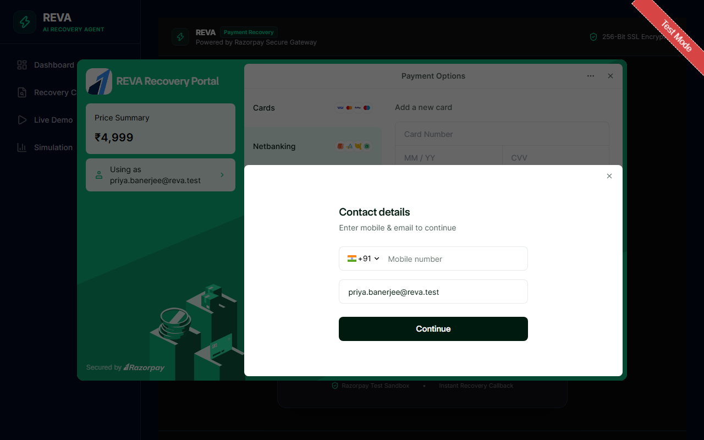

# REVA — Autonomous AI Revenue Recovery Agent

REVA is an autonomous revenue recovery agent designed to recover lost revenue from failed e-commerce and SaaS payments. Powered by FastAPI, Next.js 16, Google Gemini 3.6 Flash, a deterministic policy engine, Supabase PostgreSQL, and Razorpay Test Mode, REVA analyzes payment failures, evaluates recovery risk, enforces safety guardrails, and executes bounded recovery actions such as smart retries and personalized payment links.


---

## Problem

Digital businesses lose substantial revenue to payment failures caused by bank gateway timeouts, PSP network glitches, customer card declines, and transient UPI errors. Traditional payment gateways and merchants either leave these dropped payments unaddressed or rely on blunt, automated retry mechanisms that repeatedly hit exhausted accounts, resulting in customer churn and payment processing penalties.

---

## Solution

REVA solves payment friction by introducing an intelligent, bounded recovery workflow:
- **Real-time detection** of failed transactions and revenue at risk.
- **Root-cause diagnosis** using Google Gemini 3.6 Flash, incorporating customer payment history and failure telemetry.
- **Deterministic policy enforcement** to prevent unauthorized retries, spamming, and uncontrolled financial transactions.
- **Automated execution** of tailored recovery strategies, including time-delayed retries, alternative payment channel recommendations, and dynamic Razorpay payment links.
- **Full auditability** with immutable event logging for compliance and monitoring.

---

## Key Features

- **Autonomous Root-Cause Diagnosis**: Evaluates complex payment failures (such as PSP timeouts, insufficient balances, and issuer declines) with explainable reasoning powered by Gemini 3.6 Flash.
- **Deterministic Policy Engine**: Enforces rigid fintech compliance boundaries, ensuring AI recommendations adhere to retry limits and approval thresholds.
- **Dynamic Razorpay Integration**: Automatically generates live Razorpay payment links for high-friction failures (such as repeated UPI drops), providing customers an instant checkout alternative.
- **End-to-End Auditability**: Records every state transition, policy evaluation, and recovery action with millisecond timestamps and metadata.
- **Interactive Sandbox and Demo**: Includes four predefined recovery scenarios and a custom transaction simulator to test arbitrary amounts, payment channels, and failure codes.
- **Batch Simulation Engine**: Processes batches of 100 failed transactions to benchmark REVA recovery rates against naive retry mechanisms, with downloadable JSON reports.

---

## Architecture & Workflow

### Recovery Lifecycle Sequence

```
FAILED PAYMENT
      ↓
REVENUE RISK DETECTION
      ↓
AI DIAGNOSIS
      ↓
POLICY VALIDATION
      ↓
RECOVERY ACTION
      ↓
AUDIT TRAIL
      ↓
DASHBOARD UPDATE
```

1. **Revenue Risk Detection**: Captures failed transaction webhooks or simulated events, records the amount at risk, and initiates a recovery case.
2. **AI Diagnosis**: Google Gemini 3.6 Flash evaluates transaction attributes (payment method, failure reason code, retry history, customer success profile) and recommends a targeted recovery action.
3. **Policy Validation**: The deterministic policy engine evaluates the recommendation against hard-coded business rules.
4. **Recovery Action**: If approved, the action is executed (generating a Razorpay payment link or scheduling a smart retry).
5. **Audit Trail**: Preserves diagnosis, policy rule evaluations, and action execution details in an append-only audit trail.
6. **Dashboard Update**: Real-time recovery analytics and timeline trends immediately reflect on the merchant interface.

### System Architecture Diagram

```
┌─────────────────────────────────────────────────────────────┐
│                    Next.js 16 Dashboard                     │
│    (App Router, Recharts Analytics, Cases, Demo, Simulator) │
└──────────────────────────────┬──────────────────────────────┘
                               │ REST API
┌──────────────────────────────▼──────────────────────────────┐
│                    FastAPI Backend Server                   │
│   ┌───────────────────┐               ┌───────────────────┐ │
│   │  Cases & Metrics  │               │   Audit Logging   │ │
│   └─────────┬─────────┘               └─────────▲─────────┘ │
│             │                                   │           │
│   ┌─────────▼─────────┐               ┌─────────┴─────────┐ │
│   │  Gemini AI Engine │──────────────▶│   Policy Engine   │ │
│   │ (Diagnosis Model) │  Proposes     │ (Safety Boundary) │ │
│   └───────────────────┘               └─────────┬─────────┘ │
│                                                 │ Dispatches│
│                                       ┌─────────▼─────────┐ │
│                                       │ Razorpay Service  │ │
│                                       │(Payment Link Gen) │ │
│                                       └───────────────────┘ │
└──────────────────────────────┬──────────────────────────────┘
                               │
            ┌──────────────────┴──────────────────┐
            ▼                                     ▼
┌─────────────────────────┐           ┌─────────────────────────┐
│   Supabase PostgreSQL   │           │   In-Memory Mock DB     │
│  (Persistent Storage)   │           │  (Zero-Setup Fallback)  │
└─────────────────────────┘           └─────────────────────────┘
```

---

## AI + Policy Governance

In financial technology systems, probabilistic artificial intelligence models must not operate unconstrained. REVA enforces a strict division of responsibility:

- **AI proposes**: Google Gemini 3.6 Flash acts exclusively as a diagnostician, assessing error codes, past transaction success rates, and optimal retry paths.
- **Policy disposes**: The deterministic policy engine acts as the governing authority, strictly evaluating every proposed action against predefined rules.

### Key Guardrails
- **Retry Ceiling**: Maximum of 3 retry attempts per transaction. Any further attempt is automatically terminated to prevent card network penalties.
- **High-Value Threshold**: Any transaction equal to or exceeding INR 50,000 mandates explicit human approval (`REQUIRES_HUMAN_APPROVAL`) before any recovery action is initiated.
- **Customer Contact Limits**: Direct notifications and alternative payment links are strictly capped to prevent customer harassment.
- **Non-Recoverable Drops**: Transactions with final decline codes (such as invalid credentials or fraudulent indications) are stopped immediately without retry.

No money-related recovery action is executed without deterministic policy approval.

---

## Recovery Scenarios

REVA includes four interactive recovery scenarios for evaluation:

1. **Temporary Bank Failure**: A transient bank gateway timeout recovered via bounded retry.
2. **Repeated UPI Failure**: Multiple UPI drops where REVA switches channel and dispatches a Razorpay alternative payment link.
3. **Low Recovery Opportunity**: Max retries hit or insufficient balance — REVA safely stops recovery to eliminate friction.
4. **High-Value Transaction**: Amounts ≥ INR 50,000 requiring human operator review before execution.

---

## Razorpay Test Gateway

When high-friction payment failures occur (such as repeated UPI drops), REVA generates a dynamic payment link directing the customer to a secure checkout portal connected to the Razorpay Test Gateway.



When opened, the checkout portal launches the Razorpay Standard Checkout SDK in test mode with prefilled customer contact details (`priya.banerjee@reva.test`), enabling seamless order completion via Credit/Debit card, Netbanking, or UPI.

---

## Audit Trail & Explainability

- **Immutable Event Logging**: Every state transition, diagnosis confidence score, policy boundary evaluation, and payment link dispatch is recorded with millisecond timestamps.
- **Explainable Diagnostics**: Gemini AI outputs clear root-cause explanations alongside confidence ratings and customer-facing recovery messages.
- **Operator Review**: High-value transactions (≥ INR 50,000) are flagged for human approval before execution, maintaining complete operator oversight.

---

## Screenshots & Demo

### Recovery Dashboard

The main executive dashboard provides real-time visibility into revenue at risk, recovered revenue, active recovery cases, policy blocks, daily recovery timelines, and failure distributions across card, UPI, and netbanking methods.

### Recovery Case Workflow

The case details view displays the six-stage progression pipeline (`DETECTED → ANALYZED → DECISION → POLICY → ACTION → RESULT`), customer risk profiles, AI root-cause diagnosis, action execution status, and a chronological audit log.

### AI Diagnosis and Policy Decision

The interactive demo engine demonstrates live transaction execution, highlighting real-time stage transitions, Gemini AI diagnostic reasoning, policy engine validation, and dynamic payment link dispatch.

### Razorpay Test Gateway

The integrated checkout interface launches Razorpay Standard Checkout in test mode with prefilled contact details, allowing customers to complete dropped payments via alternative payment channels.

---

## Tech Stack

| Component | Technology | Description |
|---|---|---|
| Frontend Framework | Next.js 16 (Turbopack) | Modern React 19 architecture with App Router |
| UI Styling | Tailwind CSS v4 | Dark fintech design system |
| Visualizations | Recharts | Interactive area, bar, and pie charts |
| Backend API | FastAPI & Uvicorn | High-performance Python 3.11 asynchronous API |
| Schema Validation | Pydantic v2 | Strict data modeling and configuration management |
| AI Diagnosis | Google GenAI SDK | Gemini 3.6 Flash for transaction failure analysis |
| Policy Validation | Deterministic Rule Engine | Bounded enforcement of retry limits and high-value approvals |
| Database | Supabase PostgreSQL | Relational storage for transactions, cases, and audit logs |
| Fallback Storage | In-Memory Mock Database | Pre-seeded with 400 realistic Indian transaction records |
| Payment Gateway | Razorpay Python SDK | Test mode payment link creation and payment verification |

---

## Setup & Prerequisites

REVA includes a zero-configuration fallback mode. You can launch and test the complete application locally without external credentials.

### Prerequisites
- Python 3.11 or higher
- Node.js 18.18 or higher (with npm)

---

## Environment Variables

Both backend and frontend services provide example configuration files with safe placeholders.

### Backend Configuration (`server/.env`)
Create `server/.env` based on `server/.env.example`:

```env
DATABASE_MODE=auto
AI_MODE=auto
PAYMENT_MODE=auto

# Google Gemini AI (https://aistudio.google.com/apikey)
GEMINI_API_KEY=your_gemini_api_key_here
GEMINI_MODEL=gemini-3.6-flash

# Supabase PostgreSQL (https://supabase.com)
SUPABASE_URL=https://your-project.supabase.co
SUPABASE_SERVICE_ROLE_KEY=your_service_role_key_here

# Razorpay Test Mode (https://dashboard.razorpay.com)
RAZORPAY_KEY_ID=rzp_test_your_key_id_here
RAZORPAY_KEY_SECRET=your_razorpay_secret_here
RAZORPAY_MODE=test
```

### Frontend Configuration (`dashboard/.env.local`)
Create `dashboard/.env.local` based on `dashboard/.env.example`:

```env
NEXT_PUBLIC_API_URL=http://localhost:8000
```

---

## Running the Project

### 1. Start the Backend Server
```bash
cd server
python -m uvicorn app.main:app --reload --port 8000
```
- API Documentation (Swagger): http://localhost:8000/docs
- Health Check: http://localhost:8000/api/health

### 2. Start the Frontend Dashboard
```bash
cd dashboard
npm install
npm run dev
```
- Web Application: http://localhost:3000

---

## Testing

Run the automated test suite:
```bash
cd server
python -m unittest tests/test_reva_core.py
```

---

## Future Scope

- **Webhook Ingestion Pipeline**: Direct real-time webhook listeners for Shopify, Razorpay, and Stripe payment failure webhooks.
- **Multi-PSP Recovery**: Dynamic routing across multiple payment service providers based on real-time authorization rates.
- **Reinforcement Learning Policy Tuning**: Adaptive threshold optimization for retry windows based on historical customer response patterns.

---

## License

This project is licensed under the MIT License. See the LICENSE file for details.
