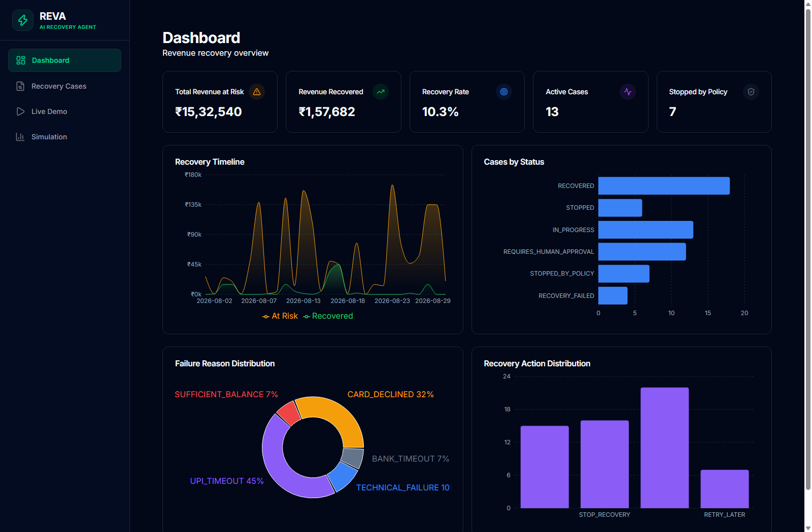
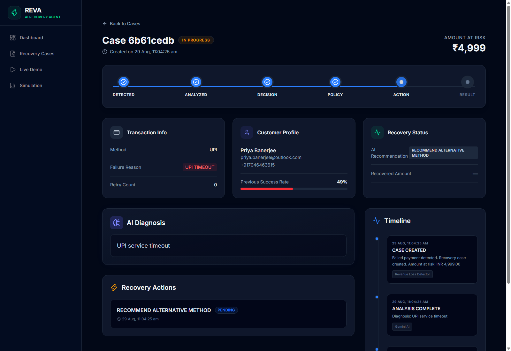
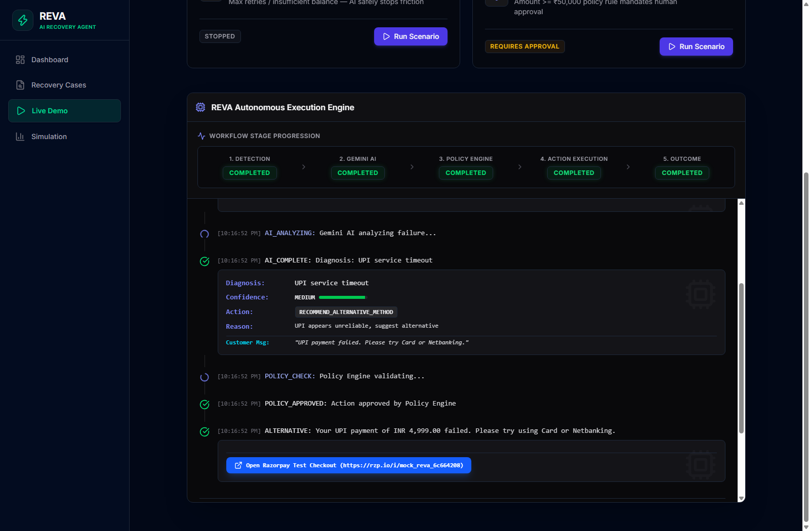
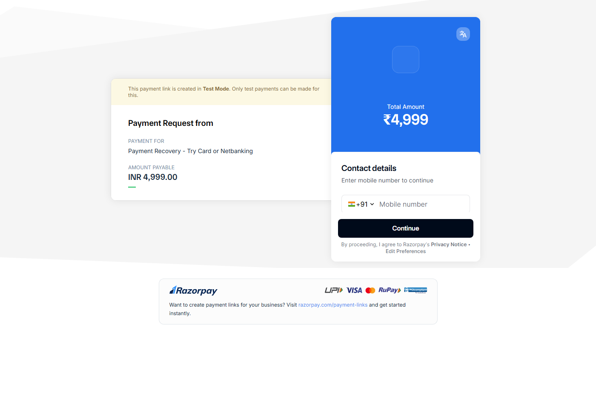

# REVA — Autonomous AI Revenue Recovery Agent

REVA is an autonomous revenue recovery agent designed to recover lost revenue from failed e-commerce and SaaS payments. Powered by FastAPI, Next.js 16, Google Gemini 3.6 Flash, a deterministic policy engine, Supabase PostgreSQL, and Razorpay Test Mode, REVA analyzes payment failures, evaluates recovery risk, enforces safety guardrails, and executes bounded recovery actions such as smart retries and personalized payment links.



---

## Overview

Digital businesses lose substantial revenue to payment failures caused by bank gateway timeouts, PSP network glitches, customer card declines, and transient UPI errors. Traditional payment gateways and merchants either leave these dropped payments unaddressed or rely on blunt, automated retry mechanisms that repeatedly hit exhausted accounts, resulting in customer churn and payment processing penalties.

REVA solves this by introducing an intelligent, bounded recovery workflow:
- Real-time detection of failed transactions and revenue at risk.
- Root-cause diagnosis using Google Gemini AI, incorporating customer payment history and failure telemetry.
- Deterministic policy enforcement to prevent unauthorized retries, spamming, and uncontrolled financial transactions.
- Automated execution of tailored recovery strategies, including time-delayed retries, alternative payment channel recommendations, and dynamic Razorpay payment links.
- Full auditability with immutable event logging for compliance and monitoring.

---

## How It Works

The core recovery lifecycle follows a strict sequence:

```
FAILED PAYMENT
      ↓
REVENUE RISK DETECTION
      ↓
AI DIAGNOSIS
      ↓
POLICY VALIDATION
      ↓
RECOVERY ACTION
      ↓
AUDIT TRAIL
      ↓
DASHBOARD UPDATE
```

1. **Revenue Risk Detection**: The system captures failed transaction webhooks or simulated events, records the amount at risk, and initiates a recovery case.
2. **AI Diagnosis**: Google Gemini 3.6 Flash evaluates the transaction attributes (payment method, failure reason code, retry history, and customer success profile) and recommends a targeted recovery action.
3. **Policy Validation**: The deterministic policy engine evaluates the recommendation against hard-coded business rules (such as retry limits and transaction value thresholds).
4. **Recovery Action**: If approved, the action is executed (for example, generating a Razorpay payment link or scheduling a smart retry). If blocked or flagged for review, human approval is requested.
5. **Audit Trail**: Every diagnosis, policy rule evaluation, and action execution is recorded in an append-only audit trail with component timestamps.
6. **Dashboard Update**: Real-time recovery analytics, timeline trends, and case statuses are immediately reflected across the merchant interface.

---

## Safety Principle

In financial technology systems, probabilistic artificial intelligence models must not operate unconstrained. REVA enforces a strict division of responsibility:

- **AI proposes**: Google Gemini acts exclusively as a diagnostician, assessing error codes, past transaction success rates, and optimal retry paths.
- **Policy disposes**: The deterministic policy engine acts as the governing authority, strictly evaluating every proposed action against predefined rules.

### Key Guardrails
- **Retry Ceiling**: Maximum of 3 retry attempts per transaction. Any further attempt is automatically terminated to prevent card network penalties.
- **High-Value Threshold**: Any transaction equal to or exceeding INR 50,000 mandates explicit human approval (`REQUIRES_HUMAN_APPROVAL`) before any recovery action is initiated.
- **Customer Contact Limits**: Direct notifications and alternative payment links are strictly capped to prevent customer harassment.
- **Non-Recoverable Drops**: Transactions with final decline codes (such as invalid credentials or fraudulent indications) are stopped immediately without retry.

No money-related recovery action is executed without deterministic policy approval.

---

## Application Screenshots

### Recovery Dashboard

The main executive dashboard provides real-time visibility into revenue at risk, recovered revenue, active recovery cases, policy blocks, daily recovery timelines, and failure distributions across card, UPI, and netbanking methods.

### Recovery Case Workflow

The case details view displays the six-stage progression pipeline (`DETECTED → ANALYZED → DECISION → POLICY → ACTION → RESULT`), customer risk profiles, AI root-cause diagnosis, action execution status, and a chronological audit log.

### AI Diagnosis and Policy Decision

The interactive demo engine demonstrates live transaction execution, highlighting real-time stage transitions, Gemini AI diagnostic reasoning, policy engine validation, and dynamic payment link dispatch.

### Razorpay Recovery Flow

Dynamic payment links generated by REVA direct customers to the official Razorpay test checkout interface, enabling customers to complete dropped orders via alternative payment methods.

---

## Key Features

- **Autonomous Root-Cause Diagnosis**: Evaluates complex payment failures (such as PSP timeouts, insufficient balances, and issuer declines) with explainable reasoning.
- **Deterministic Policy Engine**: Enforces rigid fintech compliance boundaries, ensuring AI recommendations adhere to retry limits and approval thresholds.
- **Dynamic Razorpay Integration**: Automatically generates live Razorpay payment links for high-friction failures (such as repeated UPI drops), providing customers an instant checkout alternative.
- **End-to-End Auditability**: Records every state transition, policy evaluation, and recovery action with millisecond timestamps and metadata.
- **Interactive Sandbox and Demo**: Includes four predefined recovery scenarios and a custom transaction simulator to test arbitrary amounts, payment channels, and failure codes.
- **Batch Simulation Engine**: Processes batches of 100 failed transactions to benchmark REVA recovery rates against naive retry mechanisms, with downloadable JSON reports.

---

## System Architecture

```
┌─────────────────────────────────────────────────────────────┐
│                    Next.js 16 Dashboard                     │
│    (App Router, Recharts Analytics, Cases, Demo, Simulator) │
└──────────────────────────────┬──────────────────────────────┘
                               │ REST API
┌──────────────────────────────▼──────────────────────────────┐
│                    FastAPI Backend Server                   │
│   ┌───────────────────┐               ┌───────────────────┐ │
│   │  Cases & Metrics  │               │   Audit Logging   │ │
│   └─────────┬─────────┘               └─────────▲─────────┘ │
│             │                                   │           │
│   ┌─────────▼─────────┐               ┌─────────┴─────────┐ │
│   │  Gemini AI Engine │──────────────▶│   Policy Engine   │ │
│   │ (Diagnosis Model) │  Proposes     │ (Safety Boundary) │ │
│   └───────────────────┘               └─────────┬─────────┘ │
│                                                 │ Dispatches│
│                                       ┌─────────▼─────────┐ │
│                                       │ Razorpay Service  │ │
│                                       │(Payment Link Gen) │ │
│                                       └───────────────────┘ │
└──────────────────────────────┬──────────────────────────────┘
                               │
            ┌──────────────────┴──────────────────┐
            ▼                                     ▼
┌─────────────────────────┐           ┌─────────────────────────┐
│   Supabase PostgreSQL   │           │   In-Memory Mock DB     │
│  (Persistent Storage)   │           │  (Zero-Setup Fallback)  │
└─────────────────────────┘           └─────────────────────────┘
```

---

## Tech Stack

| Component | Technology | Description |
|---|---|---|
| Frontend Framework | Next.js 16 (Turbopack) | Modern React 19 architecture with App Router |
| UI Styling | Tailwind CSS v4 | Dark fintech design system |
| Visualizations | Recharts | Interactive area, bar, and pie charts |
| Backend API | FastAPI & Uvicorn | High-performance Python 3.11 asynchronous API |
| Schema Validation | Pydantic v2 | Strict data modeling and configuration management |
| AI Diagnosis | Google GenAI SDK | Gemini 3.6 Flash for transaction failure analysis |
| Policy Validation | Deterministic Rule Engine | Bounded enforcement of retry limits and high-value approvals |
| Database | Supabase PostgreSQL | Relational storage for transactions, cases, and audit logs |
| Fallback Storage | In-Memory Mock Database | Pre-seeded with 400 realistic Indian transaction records |
| Payment Gateway | Razorpay Python SDK | Test mode payment link creation and payment verification |

---

## Application Pages and Routes

| Route | Description |
|---|---|
| `/` | Revenue recovery dashboard |
| `/cases` | Recovery case management |
| `/cases/[id]` | Detailed recovery workflow |
| `/demo` | Interactive recovery scenarios |
| `/simulation` | Batch recovery simulation |

---

## Getting Started

REVA includes a zero-configuration fallback mode. You can launch and test the complete application locally without external credentials.

### Prerequisites
- Python 3.11 or higher
- Node.js 18.18 or higher (with npm)

### 1. Start the Backend Server
```bash
cd server
python -m uvicorn app.main:app --reload --port 8000
```
- API Documentation (Swagger): http://localhost:8000/docs
- Health Check: http://localhost:8000/api/health

### 2. Start the Frontend Dashboard
```bash
cd dashboard
npm install
npm run dev
```
- Web Application: http://localhost:3000

---

## Environment Configuration

Both backend and frontend services provide example configuration files with safe placeholders.

### Backend Configuration (`server/.env`)
Create `server/.env` based on `server/.env.example`:

```env
DATABASE_MODE=auto
AI_MODE=auto
PAYMENT_MODE=auto

# Google Gemini AI (https://aistudio.google.com/apikey)
GEMINI_API_KEY=your_gemini_api_key_here
GEMINI_MODEL=gemini-3.6-flash

# Supabase PostgreSQL (https://supabase.com)
SUPABASE_URL=https://your-project.supabase.co
SUPABASE_SERVICE_ROLE_KEY=your_service_role_key_here

# Razorpay Test Mode (https://dashboard.razorpay.com)
RAZORPAY_KEY_ID=rzp_test_your_key_id_here
RAZORPAY_KEY_SECRET=your_razorpay_secret_here
RAZORPAY_MODE=test
```

### Frontend Configuration (`dashboard/.env.local`)
Create `dashboard/.env.local` based on `dashboard/.env.example`:

```env
NEXT_PUBLIC_API_URL=http://localhost:8000
```

---

## External Integrations

REVA features a dual-mode integration layer:

- **Google Gemini AI**: When `GEMINI_API_KEY` is provided, REVA dispatches structured payment failure telemetry to Gemini 3.6 Flash. When absent, an intelligent rule-based heuristic provides realistic diagnostic responses.
- **Supabase Database**: When `SUPABASE_URL` and `SUPABASE_SERVICE_ROLE_KEY` are configured, REVA reads and writes directly to PostgreSQL. When absent, it automatically falls back to an in-memory database pre-seeded with 400 realistic Indian transactions.
- **Razorpay Test Mode**: When `RAZORPAY_KEY_ID` and `RAZORPAY_KEY_SECRET` are provided, REVA generates live test checkout links (`https://rzp.io/...`) using Razorpay's API. When absent, simulated link identifiers are generated.

---

## Testing

The backend includes a comprehensive automated test suite validating configuration loading, policy boundaries, audit logging, Gemini fallback structures, and Razorpay link generation.

Run the test suite:
```bash
cd server
python -m unittest tests/test_reva_core.py
```

---

## Repository Structure

```text
RazorPay/
├── dashboard/                 # Next.js 16 frontend application
│   ├── app/                   # App Router pages and layouts
│   ├── components/            # Reusable UI components
│   ├── lib/                   # API clients and utilities
│   ├── package.json           # Frontend dependencies
│   ├── .env.example           # Frontend environment template
│   └── .gitignore             # Frontend Git ignore rules
├── server/                    # FastAPI backend server
│   ├── app/                   # API routes, models, and core services
│   │   ├── api/               # Cases, dashboard, demo, and payment endpoints
│   │   ├── models/            # Pydantic schemas and response models
│   │   ├── services/          # Gemini, policy, and recovery services
│   │   └── main.py            # Server entrypoint
│   ├── data/                  # Synthetic transactions dataset
│   ├── tests/                 # Core test suite
│   ├── requirements.txt       # Python dependencies
│   ├── .env.example           # Backend environment template
│   └── .gitignore             # Backend Git ignore rules
├── supabase/                  # Database definitions
│   ├── migrations/            # SQL migration scripts
│   └── seed.sql               # Base database schema
├── docs/                      # Documentation assets
│   └── screenshots/           # Application screenshots
├── .env.example               # Root environment template
├── .gitignore                 # Root Git exclusion rules
└── README.md                  # Project documentation
```

---

## Security and Controls

- **Credential Protection**: Real `.env` and `.env.local` files are strictly excluded via `.gitignore`. No private keys or secrets are committed to version control.
- **Deterministic Bounds**: Probabilistic AI components are restricted from triggering transactions directly; all state changes must pass through the policy engine.
- **Auditing**: Every decision, status change, and payment link creation is preserved in an immutable audit trail.
- **Approval Escalation**: Large transactions (>= INR 50,000) are placed on hold until an authorized operator reviews and approves the case.

---

## Project Scope

REVA was created as a modern AI payment recovery solution demonstrating autonomous agentic architecture within fintech safety parameters. It demonstrates how autonomous models can deliver revenue recovery without compromising risk management or customer trust.

---

## License

This project is licensed under the MIT License. See the LICENSE file for details.
